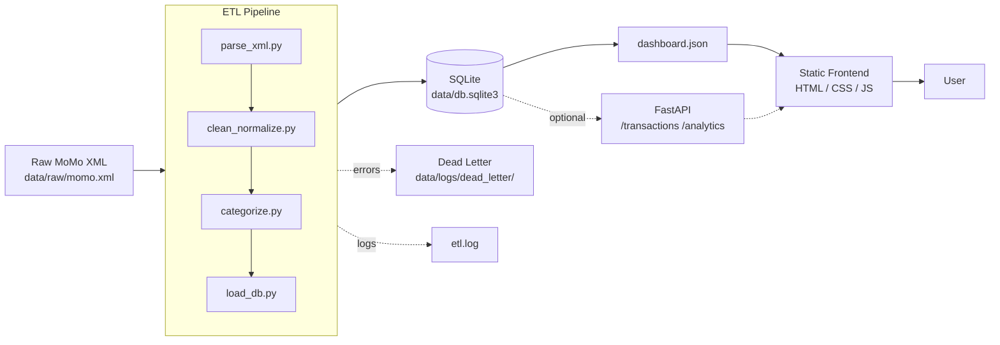
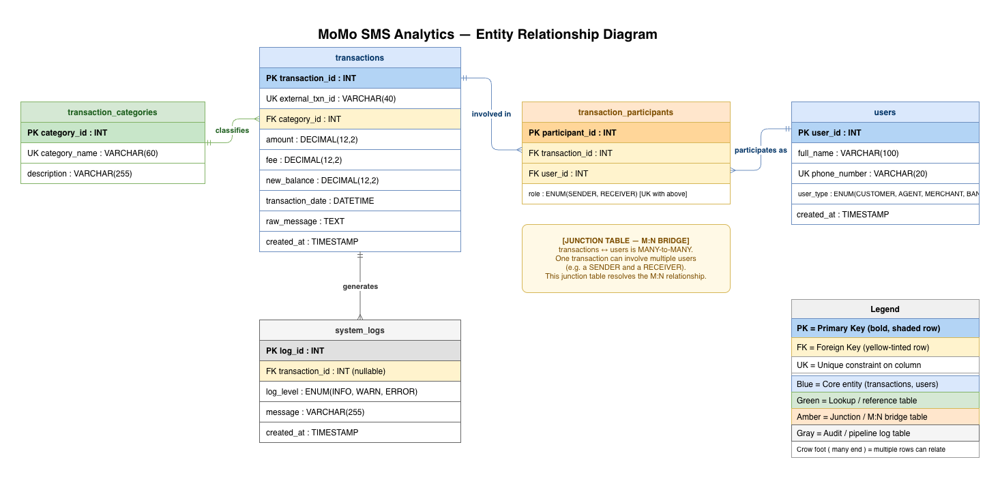

#  MoMo SMS Data Analytics Platform

> An enterprise-level fullstack application that processes Mobile Money (MoMo) SMS data, extracts and categorizes transactions, persists them in a relational database, and visualizes financial insights through an interactive dashboard.

---

## Team

**Team Name:** Underrated Silicon Valley

| Name | GitHub | Role |
|---|---|---|
| Sano Rodrigue | @SanoRod00 | ETL & Backend |
| Gary Murasira | @garymurasira | Database |
| Merci Ndekwe | @mndekwe-dot | Frontend Dashboard |
| Espoir Habimfura | @ehabimfura | API & Testing |
| David Irihose | @David-Irihose | DevOps & Docs |

---

##  Project Description

This project ingests raw MoMo (Mobile Money) SMS data in XML format and runs it through an ETL pipeline:

1. **Parse** the raw XML
2. **Clean & normalize** amounts, dates, and phone numbers
3. **Categorize** records (incoming, payment, transfer, airtime, cash power, bank deposit, etc.)
4. **Load** the cleaned records into SQLite
5. **Export** pre-aggregated metrics as `dashboard.json` for a static frontend

The dashboard displays summary cards, time-series charts, category breakdowns, and a searchable transaction table — giving users insight into their mobile money behavior.

---

##  High-Level Architecture



 **Detailed Draw.io diagram:** [Open in draw.io](https://app.diagrams.net/#Uhttps://raw.githubusercontent.com/SanoRod00/MOMO-sms-analytics/main/docs/architecture/architecture.drawio)


---

## Database Design (ERD)



The relational schema is built around five entities. **`transactions`** is the central hub, linked to **`transaction_categories`** (one category classifies many transactions) and to **`system_logs`** (one transaction generates many log entries). The relationship between `transactions` and **`users`** is many-to-many — a single transaction involves at least two users (a sender and a receiver) — and is resolved through the **`transaction_participants`** junction table, which records each party's role (`SENDER` or `RECEIVER`). Primary keys, foreign keys, and unique constraints are marked on every entity in the diagram.

Full design rationale: [docs/erd_rationale.md](./docs/erd_rationale.md)

---

## API Server

A lightweight REST API built with Python's standard library (`http.server`) — no external frameworks required. It reads `api/data/transactions.json` at startup and exposes full CRUD access over HTTP.

### Running the server

```bash
python api/server.py
# or
python3 api/server.py
# or
python -m api.server
# or
python3 -m api.server
```

The server starts on `http://localhost:8000`.

### Endpoints

| Method | Path | Description |
|--------|------|-------------|
| GET | `/` | Health check — returns API name and version |
| GET | `/transactions` | List all transactions |
| GET | `/transactions/{id}` | Fetch a single transaction by id |
| POST | `/transactions` | Create a new transaction |
| PUT | `/transactions/{id}` | Partially update a transaction |
| DELETE | `/transactions/{id}` | Delete a transaction |

### Example curl commands

```bash
# List all transactions
curl -s http://localhost:8000/transactions | head -c 500

# Fetch transaction with id 1
curl -s http://localhost:8000/transactions/1

# Create a new transaction
curl -s -X POST http://localhost:8000/transactions \
  -H "Content-Type: application/json" \
  -d '{"type":"Payment","amount":2500,"sender":"Alice","receiver":"Bob","timestamp":"2026-05-27T10:00:00"}'

# Update a transaction (replace 9999 with the id returned by POST)
curl -s -X PUT http://localhost:8000/transactions/9999 \
  -H "Content-Type: application/json" \
  -d '{"amount":3000}'

# Delete a transaction
curl -i -X DELETE http://localhost:8000/transactions/9999
```

---

##  Tech Stack

| Layer       | Tools                                           |
|-------------|--------------------------------------------------|
| ETL         | Python 3.11+, `lxml` / `ElementTree`, `dateutil` |
| Database    | SQLite 3                                         |
| API (opt.)  | FastAPI + Pydantic + Uvicorn                     |
| Frontend    | Vanilla HTML / CSS / JS + Chart.js               |
| Tests       | pytest                                           |

---

##  Project Structure

```
.
├── README.md
├── .env.example
├── requirements.txt
├── index.html              # Dashboard entry
├── web/                    # Frontend assets
│   ├── styles.css
│   └── chart_handler.js
├── data/
│   ├── raw/                # Provided XML (git-ignored)
│   ├── processed/          # dashboard.json
│   ├── db.sqlite3
│   └── logs/
├── etl/                    # ETL pipeline modules
├── api/                    # Optional FastAPI layer
├── scripts/                # Shell helpers
└── tests/                  # Unit tests
```

---

##  Setup & Run

### Prerequisites
- Python 3.11+
- pip

### Install

```bash
git clone https://github.com/<org>/<repo>.git
cd <repo>

python -m venv .venv
source .venv/bin/activate          # Linux/macOS
# .venv\Scripts\activate           # Windows

pip install -r requirements.txt
cp .env.example .env
```

### Run the ETL pipeline

```bash
bash scripts/run_etl.sh
# or directly:
python etl/run.py --xml data/raw/momo.xml
```

### Serve the dashboard

```bash
bash scripts/serve_frontend.sh
# Open http://localhost:8000
```

---

##  Scrum Board

**Board link:** [Jira — MOMO SMS Analytics](https://alustudent-team-elyjmvr5.atlassian.net/jira/software/projects/SCRUM/boards/1)

Columns: **Backlog · To Do · In Progress · In Review · Done**. Cards labeled by domain: `etl`, `db`, `frontend`, `api`, `infra`, `docs`, `testing`.


---

##  Documentation

| Document | Description |
|---|---|
| [docs/ARCHITECTURE.md](./docs/ARCHITECTURE.md) | Component breakdown, technology choices, and data-flow rationale |
| [docs/AGILE.md](./docs/AGILE.md) | Sprint cadence, ceremonies, branching conventions, and Definition of Done |
| [docs/SETUP.md](./docs/SETUP.md) | Developer onboarding — clone, install, run, and common issues |
| [CONTRIBUTING.md](./CONTRIBUTING.md) | How to propose changes, PR expectations, and the review checklist |
| [CODE_OF_CONDUCT.md](./CODE_OF_CONDUCT.md) | Community standards and enforcement process |

---

## JSON Data Modeling (Merci Ndekwe)

### Overview
JSON schemas for all 5 database entities are located in [`examples/json_schemas.json`](./examples/json_schemas.json). These schemas demonstrate how the relational database tables are serialized into JSON for API responses.

### Entities Modeled
- `transaction_categories` — lookup list of MoMo transaction types
- `users` — customers, merchants, and banks involved in transactions
- `transactions` — one record per MoMo SMS transaction
- `transaction_participants` — junction table linking transactions to users with roles
- `system_logs` — pipeline processing audit trail

### SQL-to-JSON Mapping

| SQL Table | SQL Column | SQL Type | JSON Field | JSON Type | Note |
|---|---|---|---|---|---|
| transactions | category_id | INT (FK) | category | object | FK becomes nested object |
| transaction_participants | user_id | INT (FK) | user | object | FK becomes nested object |
| transactions | amount | DECIMAL(12,2) | amount | number | No quotes — supports calculations |
| transactions | transaction_date | DATETIME | transaction_date | string | ISO format string |
| transaction_participants | role | ENUM | role | string | SENDER or RECEIVER |
| system_logs | log_level | ENUM | log_level | string | INFO, WARN, or ERROR |
| users | phone_number | VARCHAR | phone_number | string or null | null for banks (no phone) |
| transactions | external_txn_id | VARCHAR | external_txn_id | string | Unique transaction reference |

### Key Design Decisions
- **Nesting instead of foreign keys:** In SQL, relationships are expressed as foreign key IDs (e.g. `category_id`). In JSON for an API, the full related object is embedded directly so the frontend does not need to make extra lookup requests.
- **null for missing fields:** Bank users have no phone number. Using `null` keeps the field present in every user object for API consistency — omitting it entirely would break frontend code that expects the field.
- **Numbers as numbers:** Amounts, fees, and balances are JSON numbers (not strings) so they can be used directly in calculations without parsing.

### Files
- [`examples/json_schemas.json`](./examples/json_schemas.json) — all schemas, complex nested transaction, user transaction history, and API response example

---

## Database Integrity & Security (Gary Murasira)

### Overview
`database/security_integrity.sql` layers data-protection rules on top of the core schema. It runs after `database_setup.sql` and adds CHECK constraints, triggers, and views that keep the data accurate and easy to query.

### CHECK Constraints
Four constraints are added to the `transactions` table:
- `amount >= 0` — a transaction amount can never be negative
- `fee >= 0` — a fee can never be negative
- `new_balance >= 0` — a MoMo wallet cannot go below zero
- `fee <= amount` — a MoMo-specific rule: the service fee can never exceed the principal amount

### Triggers
| Trigger | Event | What it does |
|---|---|---|
| `trg_after_tx_insert` | AFTER INSERT on `transactions` | Automatically writes an INFO row to `system_logs` for every new transaction |
| `trg_before_tx_update` | BEFORE UPDATE on `transactions` | Blocks any update that would set `amount` negative or make `fee` exceed `amount` |

### Views
| View | Description |
|---|---|
| `v_transaction_summary` | Joins transactions, categories, participants, and users into one readable row — no manual JOINs needed |
| `v_daily_totals` | Total transaction volume, count, and fees grouped by calendar day |

### Files
- [`database/security_integrity.sql`](./database/security_integrity.sql) — all constraints, triggers, and views

---

##  Contributing Workflow

1. Pull latest `main`
2. Create a feature branch: `git checkout -b feat/<short-description>`
3. Use conventional commits: `feat:`, `fix:`, `docs:`, `chore:`
4. Open a PR — require 1 review before merge
5. Move the corresponding Scrum card to **Done** after merge

---

##  License

MIT — see [LICENSE](./LICENSE).

---

## XML Parser (David)

Script: `api/parse_xml.py`
Output: `api/data/transactions.json` (1,691 records)

Parses `data/modified_sms_v2.xml` into a JSON array of transaction records
consumed by the REST API. For each SMS it classifies the transaction type,
extracts amount, fee, balance, external TxId, sender and receiver via
regex, and converts the Android millisecond timestamp to ISO-8601 UTC.
Malformed records are logged and skipped without aborting the batch.

**Category distribution (1,691 records):**

| Category | Count |
|---|---|
| Payment to Code Holder | 713 |
| Transfer to Mobile | 585 |
| Bank Deposit | 248 |
| Incoming Money | 63 |
| Other | 58 |
| Internet Bundle | 19 |
| Cash Withdrawal | 3 |
| Reversal | 2 |

**Run:**

    python3 api/parse_xml.py
    python3 api/parse_xml.py --input data/modified_sms_v2.xml --output api/data/transactions.json