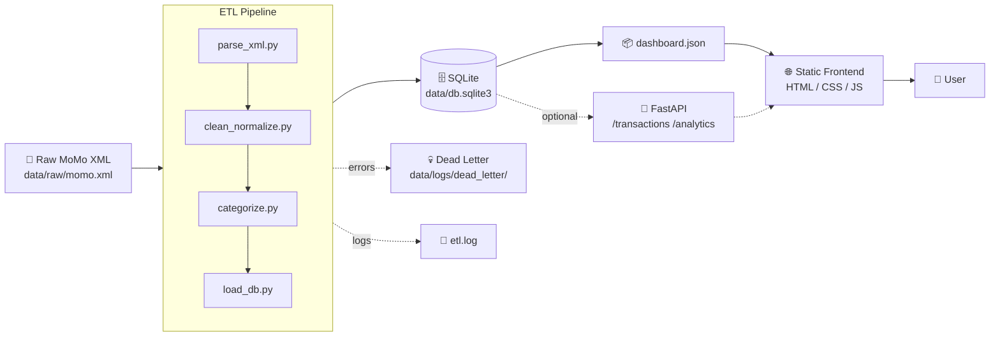

# 📱 MoMo SMS Data Analytics Platform

> An enterprise-level fullstack application that processes Mobile Money (MoMo) SMS data, extracts and categorizes transactions, persists them in a relational database, and visualizes financial insights through an interactive dashboard.

---

## 👥 Team

**Team Name:** _[Add your team name here]_

| Name | Role | GitHub |
|------|------|--------|
| _Member 1_ | ETL & Backend | `@username` |
| _Member 2_ | Database & API | `@username` |
| _Member 3_ | Frontend Dashboard | `@username` |

---

## 📋 Project Description

This project ingests raw MoMo (Mobile Money) SMS data in XML format and runs it through an ETL pipeline:

1. **Parse** the raw XML
2. **Clean & normalize** amounts, dates, and phone numbers
3. **Categorize** records (incoming, payment, transfer, airtime, cash power, bank deposit, etc.)
4. **Load** the cleaned records into SQLite
5. **Export** pre-aggregated metrics as `dashboard.json` for a static frontend

The dashboard displays summary cards, time-series charts, category breakdowns, and a searchable transaction table — giving users insight into their mobile money behavior.

---

## 🏗️ High-Level Architecture



📐 **Detailed Draw.io diagram:** [Open in draw.io](<SHARE_LINK>)

---

## 🛠️ Tech Stack

| Layer       | Tools                                           |
|-------------|--------------------------------------------------|
| ETL         | Python 3.11+, `lxml` / `ElementTree`, `dateutil` |
| Database    | SQLite 3                                         |
| API (opt.)  | FastAPI + Pydantic + Uvicorn                     |
| Frontend    | Vanilla HTML / CSS / JS + Chart.js               |
| Tests       | pytest                                           |

---

## 📁 Project Structure

```
.
├── README.md
├── .env.example
├── requirements.txt
├── index.html              # Dashboard entry
├── web/                    # Frontend assets
│   ├── styles.css
│   └── chart_handler.js
├── data/
│   ├── raw/                # Provided XML (git-ignored)
│   ├── processed/          # dashboard.json
│   ├── db.sqlite3
│   └── logs/
├── etl/                    # ETL pipeline modules
├── api/                    # Optional FastAPI layer
├── scripts/                # Shell helpers
└── tests/                  # Unit tests
```

---

## 🚀 Setup & Run

### Prerequisites
- Python 3.11+
- pip

### Install

```bash
git clone https://github.com/<org>/<repo>.git
cd <repo>

python -m venv .venv
source .venv/bin/activate          # Linux/macOS
# .venv\Scripts\activate           # Windows

pip install -r requirements.txt
cp .env.example .env
```

### Run the ETL pipeline

```bash
bash scripts/run_etl.sh
# or directly:
python etl/run.py --xml data/raw/momo.xml
```

### Serve the dashboard

```bash
bash scripts/serve_frontend.sh
# Open http://localhost:8000
```

---

## 📊 Scrum Board

🗂️ **Board link:** _[Add your GitHub Projects / Trello / Jira link here]_

Three columns: **To Do · In Progress · Done**. Issues labeled by domain: `etl`, `db`, `frontend`, `api`, `infra`, `docs`, `testing`.

---

## 🤝 Contributing Workflow

1. Pull latest `main`
2. Create a feature branch: `git checkout -b feat/<short-description>`
3. Use conventional commits: `feat:`, `fix:`, `docs:`, `chore:`
4. Open a PR — require 1 review before merge
5. Move the corresponding Scrum card to **Done** after merge

---

## 📝 License

MIT — see [LICENSE](./LICENSE).
