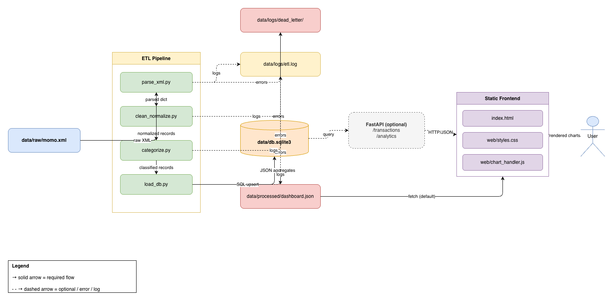

#  MoMo SMS Data Analytics Platform

> An enterprise-level fullstack application that processes Mobile Money (MoMo) SMS data, extracts and categorizes transactions, persists them in a relational database, and visualizes financial insights through an interactive dashboard.

---

## Team

**Team Name:** Underrated Silicon Valley

| Name | GitHub | Role |
|---|---|---|
| Sano Rodrigue | @SanoRod00 | ETL & Backend |
| Gary Murasira | @garymurasira | Database |
| Merci Ndekwe | @mndekwe-dot | Frontend Dashboard |
| Espoir Habimfura | @ehabimfura | API & Testing |
| David Irihose | @David-Irihose | DevOps & Docs |

---

##  Project Description

This project ingests raw MoMo (Mobile Money) SMS data in XML format and runs it through an ETL pipeline:

1. **Parse** the raw XML
2. **Clean & normalize** amounts, dates, and phone numbers
3. **Categorize** records (incoming, payment, transfer, airtime, cash power, bank deposit, etc.)
4. **Load** the cleaned records into SQLite
5. **Export** pre-aggregated metrics as `dashboard.json` for a static frontend

The dashboard displays summary cards, time-series charts, category breakdowns, and a searchable transaction table — giving users insight into their mobile money behavior.

---

##  High-Level Architecture


 **Detailed Draw.io diagram:** [Open in draw.io](https://app.diagrams.net/#Uhttps://raw.githubusercontent.com/SanoRod00/MOMO-sms-analytics/main/docs/architecture/architecture.drawio)



---

##  Tech Stack

| Layer       | Tools                                           |
|-------------|--------------------------------------------------|
| ETL         | Python 3.11+, `lxml` / `ElementTree`, `dateutil` |
| Database    | SQLite 3                                         |
| API (opt.)  | FastAPI + Pydantic + Uvicorn                     |
| Frontend    | Vanilla HTML / CSS / JS + Chart.js               |
| Tests       | pytest                                           |

---

##  Project Structure

```
.
├── README.md
├── .env.example
├── requirements.txt
├── index.html              # Dashboard entry
├── web/                    # Frontend assets
│   ├── styles.css
│   └── chart_handler.js
├── data/
│   ├── raw/                # Provided XML (git-ignored)
│   ├── processed/          # dashboard.json
│   ├── db.sqlite3
│   └── logs/
├── etl/                    # ETL pipeline modules
├── api/                    # Optional FastAPI layer
├── scripts/                # Shell helpers
└── tests/                  # Unit tests
```

---

##  Setup & Run

### Prerequisites
- Python 3.11+
- pip

### Install

```bash
git clone https://github.com/<org>/<repo>.git
cd <repo>

python -m venv .venv
source .venv/bin/activate          # Linux/macOS
# .venv\Scripts\activate           # Windows

pip install -r requirements.txt
cp .env.example .env
```

### Run the ETL pipeline

```bash
bash scripts/run_etl.sh
# or directly:
python etl/run.py --xml data/raw/momo.xml
```

### Serve the dashboard

```bash
bash scripts/serve_frontend.sh
# Open http://localhost:8000
```

---

##  Scrum Board

**Board link:** [Jira — MOMO SMS Analytics](https://alustudent-team-elyjmvr5.atlassian.net/jira/software/projects/SCRUM/boards/1)

Columns: **Backlog · To Do · In Progress · In Review · Done**. Cards labeled by domain: `etl`, `db`, `frontend`, `api`, `infra`, `docs`, `testing`.


---

##  Documentation

| Document | Description |
|---|---|
| [docs/ARCHITECTURE.md](./docs/ARCHITECTURE.md) | Component breakdown, technology choices, and data-flow rationale |
| [docs/AGILE.md](./docs/AGILE.md) | Sprint cadence, ceremonies, branching conventions, and Definition of Done |
| [docs/SETUP.md](./docs/SETUP.md) | Developer onboarding — clone, install, run, and common issues |
| [CONTRIBUTING.md](./CONTRIBUTING.md) | How to propose changes, PR expectations, and the review checklist |
| [CODE_OF_CONDUCT.md](./CODE_OF_CONDUCT.md) | Community standards and enforcement process |

---

## JSON Data Modeling (Merci Ndekwe)

### Overview
JSON schemas for all 5 database entities are located in [`examples/json_schemas.json`](./examples/json_schemas.json). These schemas demonstrate how the relational database tables are serialized into JSON for API responses.

### Entities Modeled
- `transaction_categories` — lookup list of MoMo transaction types
- `users` — customers, merchants, and banks involved in transactions
- `transactions` — one record per MoMo SMS transaction
- `transaction_participants` — junction table linking transactions to users with roles
- `system_logs` — pipeline processing audit trail

### SQL-to-JSON Mapping

| SQL Table | SQL Column | SQL Type | JSON Field | JSON Type | Note |
|---|---|---|---|---|---|
| transactions | category_id | INT (FK) | category | object | FK becomes nested object |
| transaction_participants | user_id | INT (FK) | user | object | FK becomes nested object |
| transactions | amount | DECIMAL(12,2) | amount | number | No quotes — supports calculations |
| transactions | transaction_date | DATETIME | transaction_date | string | ISO format string |
| transaction_participants | role | ENUM | role | string | SENDER or RECEIVER |
| system_logs | log_level | ENUM | log_level | string | INFO, WARN, or ERROR |
| users | phone_number | VARCHAR | phone_number | string or null | null for banks (no phone) |
| transactions | external_txn_id | VARCHAR | external_txn_id | string | Unique transaction reference |

### Key Design Decisions
- **Nesting instead of foreign keys:** In SQL, relationships are expressed as foreign key IDs (e.g. `category_id`). In JSON for an API, the full related object is embedded directly so the frontend does not need to make extra lookup requests.
- **null for missing fields:** Bank users have no phone number. Using `null` keeps the field present in every user object for API consistency — omitting it entirely would break frontend code that expects the field.
- **Numbers as numbers:** Amounts, fees, and balances are JSON numbers (not strings) so they can be used directly in calculations without parsing.

### Files
- [`examples/json_schemas.json`](./examples/json_schemas.json) — all schemas, complex nested transaction, user transaction history, and API response example

---

##  Contributing Workflow

1. Pull latest `main`
2. Create a feature branch: `git checkout -b feat/<short-description>`
3. Use conventional commits: `feat:`, `fix:`, `docs:`, `chore:`
4. Open a PR — require 1 review before merge
5. Move the corresponding Scrum card to **Done** after merge

---

##  License

MIT — see [LICENSE](./LICENSE).
