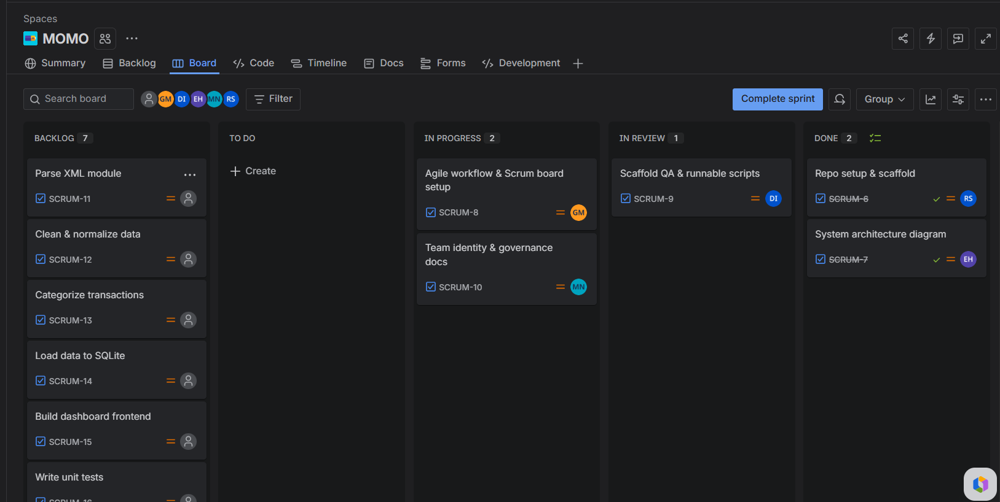

# Agile Workflow

We follow a lightweight Scrum process adapted for a 5-person student team.
The live board is on Jira: [https://alustudent-team-elyjmvr5.atlassian.net/jira/software/projects/SCRUM/boards/1]

## How our sprints work

Each sprint runs one week, Monday to Sunday. On Mondays we do a quick
planning session where we pull cards from the Backlog into To Do and
agree on who owns what. On Fridays, our class meeting doubles as both
a sprint review (we demo what got done) and a retrospective (what
slowed us down, what to do differently).

Daily standups happen async on WhatsApp — three lines: what I did,
what I'm doing today, any blockers.

## Board columns

| Column | What it means |
|---|---|
| Backlog | Work we know about but haven't scheduled yet |
| To Do | Committed for this sprint, not started |
| In Progress | Someone is actively working on it |
| In Review | PR is open and waiting for approval |
| Done | Merged into main, card closed |

## Branch naming

We follow a simple pattern: `type/short-description`

- `feat/` — new functionality
- `fix/` — bug fixes
- `docs/` — documentation changes only
- `chore/` — scripts, config, tooling

Example: `feat/xml-parser`, `docs/setup-guide`

## Commit messages

We use conventional commits so the history stays readable:

<type>: <short summary>

Types we use: `feat`, `fix`, `docs`, `chore`, `test`, `refactor`

Real example from this project: `feat: add XML parser for incoming money transactions`

## Pull request rules

- Title follows the same conventional commit format
- Description includes the Jira card number (e.g. SCRUM-8)
- At least one teammate approves before anyone merges
- The person who opened the PR moves the card to Done after merge
- Branch gets deleted after merge to keep the repo clean

## Code review checklist

Before approving a PR, reviewers check:

- [ ] Runs locally without errors
- [ ] No hardcoded secrets, API keys, or real user data
- [ ] Files are in the right folders per the project structure
- [ ] Tests added or updated if the logic changed
- [ ] Docs or README updated if something behavioral changed

## Definition of Done

A card only moves to Done when all of these are true:

- [ ] Code merged into `main`
- [ ] Related documentation updated
- [ ] Tests pass (where applicable)
- [ ] No unresolved review comments
- [ ] Card moved to Done on the Jira board

## Labels

We label every card with its domain so the board is easy to filter:
`infra` · `etl` · `db` · `api` · `frontend` · `docs` · `testing` · `bug` · `blocked`

## Sprint roles

- **Scrum Master** — runs ceremonies and clears blockers. Rotates each sprint. *Sprint 1: John*
- **Reviewer of the week** — handles first-pass PR reviews. *Sprint 1: Sano*